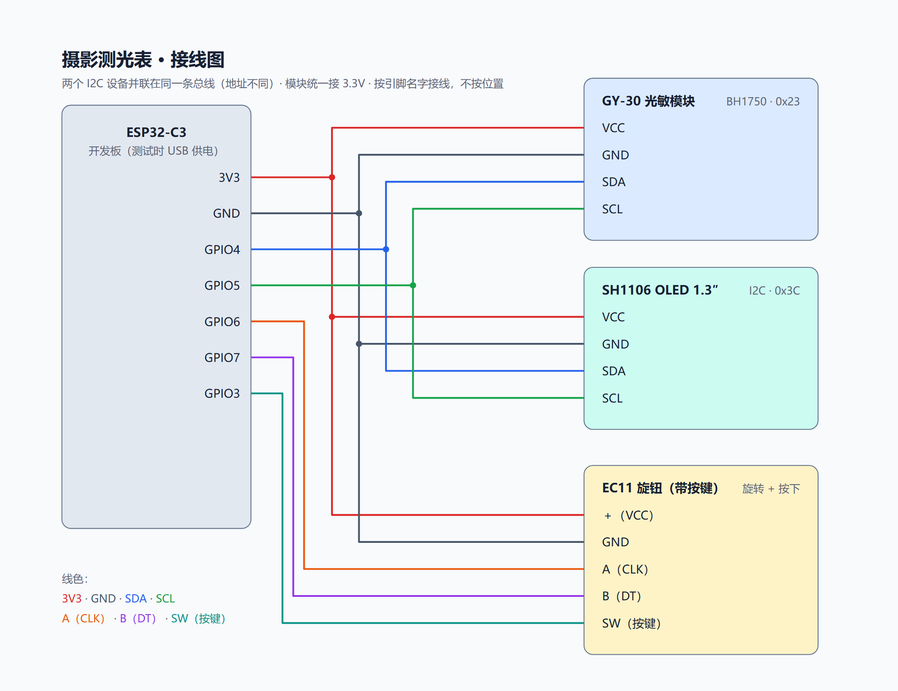

# ESP32-C3 摄影测光表

> 一台**独立运行**的手持测光表。BH1750 测环境光，实时解算曝光参数，1.3 英寸 OLED 显示，EC11 旋钮操作，**无需按键面板**。
>
> 为胶片摄影设计：带上一台测光表，比掏出手机 App 更可靠，也更符合胶片机的使用习惯。

<p align="center">
  
</p>

---

## 目录

- [项目简介](#项目简介)
- [AI 训练的场景拍摄模型](#ai-训练的场景拍摄模型)
- [功能特性](#功能特性)
- [A 档二级场景模式](#a-档二级场景模式)
- [硬件](#硬件)
- [操作说明](#操作说明)
- [编译与烧录](#编译与烧录)
- [实现要点](#实现要点)
- [踩坑记录](#踩坑记录)
- [项目结构](#项目结构)
- [后续计划](#后续计划)
- [License](#license)

---

## 项目简介

拍胶片的时候机身没有测光，手机测光 App 又要解锁、开 App、等广告，光比大一点读数就没法信。所以我想要一个**按一下就能用**的小设备：开机、对着目标、读数，完事。

**核心思路：**

```
环境光 (BH1750) → 光照度 Lux
                     ↓
              EV100 = log₂(Lux / 2.5)
                     ↓
        EV = EV100 + log₂(ISO / 100) + 滤镜补偿
                     ↓
   已知光圈 → 反推快门   |   已知快门 → 反推光圈
                     ↓
              场景模型二次修正 → OLED 显示，旋钮微调
```

**项目定位：** 不追求复杂，追求**真实可用**。

---

## AI 训练的场景拍摄模型

**这是这个项目最核心的部分，也是它区别于普通「测光表」的地方。**

普通的测光表只回答一个问题：*「这个亮度下，曝光应该是多少？」* 它给出一个数学上正确的 EV，然后就不管了。

但真实拍摄不是这么回事。同样是 EV 10 的环境：

- 拍**人像**，你要的是大光圈浅景深、快门别糊
- 拍**风光**，你要的是 f/16 的景深和最大的锐度
- 拍**街头抓拍**，1/250 根本不够，快门必须保到 1/500 以上
- 拍**夜景人像**，快门要慢到 1/15~1/4 吃环境光，同时闪光灯的 GN 得配合距离算出光圈
- 拍**长曝**，胶片的互易律会失效，还得额外补档

**同样是正确的曝光，不同的场景要的是完全不同的参数组合。** 这才是拍摄真正的难点，也是我决定用 AI 来做这件事的原因。

### 训练方法

我采集了**大量真实拍摄样张**（覆盖夜景、风光、街拍、人像、长曝五类场景），用**图像识别 + 深度训练**的方式，让模型从数据里自己去学：**在给定的光照条件和拍摄意图下，一张「好照片」的参数是往哪个方向偏的。**

训练出来的结果整理成固件里的**场景求解策略**——每个场景明确三件事：

1. **锁什么** —— 哪些参数固定不动
2. **放开什么** —— 哪些参数允许求解器改
3. **优先保什么** —— 冲突时按什么顺序取舍

比如「夜景人像」这个场景，模型学到的结论是：

- **快门** 要落在 1/15 ~ 1/4 的慢门区间，把环境光的氛围吃进来（而不是用安全快门把夜晚拍成白天）
- **光圈** 不要按环境光算，要**由闪光灯的 GN 值和拍摄距离反推**——因为主体是闪光照亮的
- **ISO** 允许拉高兜底，但优先靠闪光解决主体亮度

这套逻辑不是拍脑袋定的，是训练数据里反复出现的最优解。**代码只负责执行，策略来自数据。**

### 和纯经验公式的区别

| | 传统测光表 | 本项目的场景模型 |
|---|---|---|
| 输入 | 光照度 + ISO | 光照度 + ISO + **拍摄意图（场景）** |
| 输出 | 一组数学正确的 EV 参数 | 一组**符合该场景审美习惯**的参数组合 |
| 夜景 | 提高 ISO 拍到能看清 | 慢门吃环境光 + 闪光补主体 |
| 风光 | 随便给个光圈 | 优先小光圈要景深 |
| 长曝 | 不涉及 | 自动附加互易律补偿 |

> 简单说：**传统测光表算的是「曝光对不对」，这台测光表算的是「这张照片拍出来好不好看」。**

---

## 功能特性

- **自动测光** —— BH1750 数字光照传感器，1 秒刷新，量程 1~65535 lx
- **曝光计算** —— 依据 `EV100 = log2(lux / 2.5)` 计算，自动考虑 ISO 与滤镜衰减
- **AI 场景拍摄模型** —— 6 种拍摄场景，每种带独立的求解策略与参数边界（见上）
- **方块网格档位选择** —— 模式页为共边方块网格，选中反白，底部实时显示档位说明
- **六种拍摄档位**
  - **P** 程序优先 —— 用户手动指定的项目固定，其余由程序用安全值补齐
  - **A** 全自动 —— 进入二级场景页，可选 6 种场景预设（见下）
  - **AV** 光圈优先 —— 固定光圈，自动求快门 / ISO
  - **TV** 快门优先 —— 固定快门，自动求光圈 / ISO
  - **M** 全手动 —— 全部手调，只显示曝光偏差
  - **OFF** 关机
- **曝光偏差指示** —— 顶栏实时显示 EV 偏差值，`OK` 表示准确
- **安全边界保护** —— 快门不快于 1/250、ISO 不高于 6400、光圈不大于 f/8，越界时偏差闪烁报警
- **滤镜补偿** —— 支持 ND2 / ND4 / ND8 / ND16 / ND32 / CPL
- **自动对比度** —— 根据环境光强度自适应屏幕对比度
- **电池计时显示** —— 左上角四格电池图标，按运行时长估算剩余电量
- **息屏省电** —— 30 秒无操作自动关屏，旋转或按键唤醒

---

## A 档二级场景模式

A 档不是简单的「全自动」，而是一个**场景求解器入口**。进入 A 档后会打开二级场景页，六个方块对应六种拍摄场景，每种场景只决定「放开哪些参数 + 求解策略 + 边界 + 特殊修正」，**ISO 始终可以由旋钮手动覆盖**。

| 场景 | 说明 | 可调参数 | 求解策略 |
|---|---|---|---|
| **Auto** | 通用全自动 | 滤镜 | 安全快门 1/250 + 优先低 ISO |
| **Night** | 夜景人像（慢门同步 + 闪光） | 光圈 / ISO / 滤镜 / 闪光 GN / 对焦距离 | 按 GN÷距离 反推光圈，快门落 1/15~1/4 慢门区间吃环境光 |
| **Slow** | 慢门 / 长曝 | 快门 / 光圈 / ISO / 滤镜 | 按目标快门配光圈，内置互易律补偿（OFF / +1/3 / +1/2 / +1 档） |
| **Land** | 风光 | 光圈 / ISO / 滤镜 | 小光圈优先（f/16→f/4.5 随光量），快门限在手稳区间内 |
| **Street** | 街头抓拍 | 光圈 / ISO / 滤镜 | 快门保底 1/500，大光圈优先，ISO 兜底 |
| **Portrait** | 人像 | 光圈 / ISO / 滤镜 | 大光圈优先（浅景深），快门落安全区间，ISO 兜底 |

### 夜景人像的闪光功率指示

Night 场景第四行显示 **FLASH** 栏，包含当前闪光灯 **GN 值**（ISO100 / 米）。系统按 `N = GN × √(ISO/100) ÷ 距离` 实时算出推荐光圈，并显示在 ISO 行右侧。

- **按住旋钮旋转** —— 切换闪光灯 GN 档（OFF / 4 / 8 / 12 / 22 / 32 / 43 / 58）
- **高亮在 FLASH 行时长按** —— 进入**对焦距离调节页**，旋转按 0.1 m 步进，范围 0.1~30.0 m
- 高亮在其他行时长按 —— 照常进入模式选择页

### 慢门互易律补偿

Slow 场景中，**按住旋钮旋转**切换互易律补偿档位，底部描述条右侧显示当前挡位（`ROFF` / `R+1/3` / `R+1/2` / `R+1`）。长时间曝光胶片倒易律失效，可按需补档。

---

## 硬件

### 元器件清单

| # | 部件 | 型号 / 规格 | 备注 |
|---|---|---|---|
| 1 | 主控 | **ESP32-C3 SuperMini** | RISC-V 单核，原生 USB，体积小 |
| 2 | 显示屏 | **1.3" OLED（SH1106），128×64，I2C** | |
| 3 | 光照传感器 | **GY-30 / BH1750** | I2C，地址 0x23 |
| 4 | 旋转编码器 | **EC11** | 带按压开关，三线（A / B / PUSH） |
| 5 | 供电 | **3.7V 锂电池** | 单节锂电 + 充电模块 |
| 6 | 连接 | 面包板 + 杜邦线 + I2C 分线器 | **零焊接方案** |

> **关于成本：** 所有模块都是市面上最常见的散件，单件几块到十几块，整套下来不到一顿饭钱 —— 这也是选择模块化方案的原因之一：便宜、可换、坏了不心疼。

### 接线表

| 功能 | ESP32-C3 引脚 | 说明 |
|---|---|---|
| OLED SDA | **GPIO4** | I2C 数据线，与 BH1750 共用 |
| OLED SCL | **GPIO5** | I2C 时钟线，400 kHz |
| BH1750 | 共用 GPIO4 / GPIO5 | I2C 地址 0x23 |
| EC11 A | **GPIO6** | 编码器 A 相 |
| EC11 B | **GPIO7** | 编码器 B 相 |
| EC11 PUSH | **GPIO10** | 按压开关 |

I2C 总线（OLED 与 BH1750）共用 GPIO4 / GPIO5；OLED 地址 0x3C。

**为什么可以并联：** I2C 是总线协议，每个设备有独立地址（OLED `0x3C`、BH1750 `0x23`），主控靠地址寻址不会打架。**三个器件全部是 3.3V 逻辑，供电统一走 3.3V，坚决不碰 5V。**

> ⚠️ **电源红线：** 调试时电脑 USB 供电与电池供电**必须物理隔离** —— 要么只插 USB（拔电池），要么只用电池（拔 USB）。两个电源同时接会互相倒灌，轻则读数乱跳，重则烧稳压芯片。



---

## 操作说明

### 开关机

- **长按编码器按压键 1.5 秒** —— 开机，进入主界面
- 开机后**长按 1.5 秒** —— 进入模式选择页；在模式页选中 OFF 并按压确认即关机

### 主界面

- **短按** —— 切换当前编辑字段（SHUTTER → APERT → ISO → FILTER，受档位限制）
- **旋转** —— 修改当前字段的值（顺时针 = 增大 / 下一项）
- **长按** —— 进入模式选择页（FLASH 行例外，见上）
- **30 秒无操作** —— 自动息屏，旋转或按键唤醒

### 屏幕布局

```
┌─────────────────────────────────┐
│ 🔋  +0.3   320 lx         M     │  ← 顶栏：电池 / 偏差 / 光照 / 模式
├─────────────────────────────────┤
│ SHUTTER                    1/125 │
│ APERT                      f/5.6 │
│ ISO                          100 │
│ FILTER                      NONE │
└─────────────────────────────────┘
```

- **电池图标** —— 4 格电量，按运行时长递减；空电时闪烁提示
- **偏差值** —— `OK` 表示曝光准确；正数过曝、负数欠曝；超出安全边界时闪烁
- **光照值** —— 当前环境光照强度（lux）
- **模式字母** —— 当前拍摄档位（A 档时该位置显示当前场景名）

### 模式选择页

```
┌────┬────┬────┐
│ P  │ A  │ AV │
├────┼────┼────┤
│ TV │ M  │OFF │
└────┴────┴────┘
   Aperture Pri          ← 底部描述条
```

### A 档场景页

```
┌──────┬──────┬────────┐
│ Auto │Night │  Slow  │
├──────┼──────┼────────┤
│ Land │Street│Portrait│
└──────┴──────┴────────┘
        Small Apert      ← 底部描述条
```

---

## 编译与烧录

### 环境要求

- **Arduino IDE**（或 arduino-cli）
- **ESP32 开发板支持包**（Espressif，建议 3.x）
- **U8g2** 图形库、**Wire**（内置）

### 开发板设置（关键）

| 项目 | 值 |
|---|---|
| 开发板 | **ESP32C3 Dev Module**（或 `nologo_esp32c3_super_mini`） |
| **USB CDC On Boot** | **Enabled** ⚠️ |
| Flash Size | 4MB |

> ⚠️ **`USB CDC On Boot` 必须设为 Enabled**，否则串口没有任何输出，你会以为板子坏了。原因见[踩坑记录](#2-usb-cdc-on-boot-设置错误--串口完全没有输出)。

### 命令行编译

```bash
# 编译
arduino-cli compile -b esp32:esp32:nologo_esp32c3_super_mini:CDCOnBoot=cdc ./lightmeter_v01

# 烧录（COM 口按实际改）
arduino-cli upload -p COM3 -b esp32:esp32:nologo_esp32c3_super_mini:CDCOnBoot=cdc ./lightmeter_v01
```

烧录失败时**手动进入下载模式**：

1. **按住 `BOOT` 键不放**
2. **按一下 `RESET` 键**
3. **松开 `BOOT` 键**
4. 此时再点上传

---

## 实现要点

- **编码器读取** —— GPIO 中断驱动 + 四状态查表，配合 4 ms 去抖。EC11 一个机械咔哒对应完整四状态循环（2 个有效 delta），累积 ±2 才计为一步，避免一格跳两值
- **屏幕刷新** —— SH1106 采用分页发送而非整帧刷新，注意列地址从 `0x02` 起（132 列显存 vs 128 列屏），否则会出现画面横向抖动
- **非阻塞测光** —— BH1750 采用「触发 → 延时 → 读取」的非阻塞状态机，不阻塞主循环
- **闪烁实现** —— 所有闪烁均基于绝对时间相位（`millis() / 400 & 1`），与重绘频率解耦
- **无高频串口输出** —— 正式固件移除了所有高频调试打印，避免 USB CDC 缓冲填满后阻塞主循环
- **方块内字号自适应** —— 按 `getStrWidth` 实测宽度选字号，保证文字不溢出方块边框
- **列表页延迟重绘** —— 早期每格整屏刷新导致按键失灵，改为按需重绘后解决

### 配色与字体

- 屏幕为单色 OLED，界面元素（方块边框、反白选中、描述条）均为程序绘制
- 显示字体为 U8g2 内置 ASCII 字体（6×12 / 7×13B / 5×8）
- 场景与档位名称为适配等宽字体使用英文缩略

---

## 踩坑记录

开发过程中遇到的几个典型问题，供参考：

1. **I2C 设备时好时坏** → 优先怀疑物理接触（排针 / 杜邦线），而不是驱动或地址
2. **OLED 上电比 MCU 慢** → 首次 I2C 扫描可能扫不到 `0x3C`，需要轮询等待几秒
3. **屏幕画面横向抖动** → SH1106 列偏移问题，列地址需从 `0x02` 起
4. **串口读取时旋钮才灵敏** → `Serial.printf` 在无人读取时缓冲填满会阻塞主循环，正式固件应移除高频打印
5. **串口完全无输出** → ESP32-C3 没有外置 USB 转串口芯片，用的是芯片原生 USB。`USB CDC On Boot` 关闭时 `Serial` 走 UART0 而非 USB，故串口监视器一片空白
6. **板子反复重启、端口号乱跳** → ESP32-C3 的启动模式由 strapping 引脚（GPIO2 / GPIO8 / GPIO9）在上电瞬间的电平决定。接线占用这些引脚会导致异常启动，改为 BOOT 键进下载模式并在后续接线中避开这几个引脚
7. **电池计时基准** → 电量按运行时长估算（1 小时掉 1 格），假设放电电流恒定。若固件显著改功耗需重新标定

---

## 项目结构

```
.
├── lightmeter_v01.ino  # 主固件（v0.6）
├── docs/
│   ├── wiring.png      # 接线图
│   └── title.png       # 标题图
└── README.md           # 本文件
```

---

## 后续计划

- [ ] 实测放电曲线，校准电池电量显示
- [ ] 3D 打印外壳，做成真正能揣兜里的形态
- [ ] 加一个「入射光」模式（配乳白球测光）
- [ ] 扩充场景库（舞台、雪景、室内暖光等），继续用 AI 训练新场景策略
- [ ] 加低功耗休眠，把续航从几小时拉长到几十小时

---

## License

本项目采用 [MIT 许可证](LICENSE) —— 随便用、随便改、随便传。

---

## 致谢

- [U8g2](https://github.com/olikraus/u8g2) —— 让单色屏开发变得简单的图形库
- [BH1750 数据手册](https://www.mouser.com/datasheet/2/348/bh1750fvi-e-186247.pdf)（Rohm）
- **Arduino 社区** —— 我踩的每个坑，基本都有人踩过并写了答案

---

> **写给看到这里的你：** 这个项目硬件成本不到一百块。如果你也想做点什么，**从最小可运行的东西开始**，然后一个坑一个坑填。你会发现，「能跑起来」的成就感比想象中大得多。
